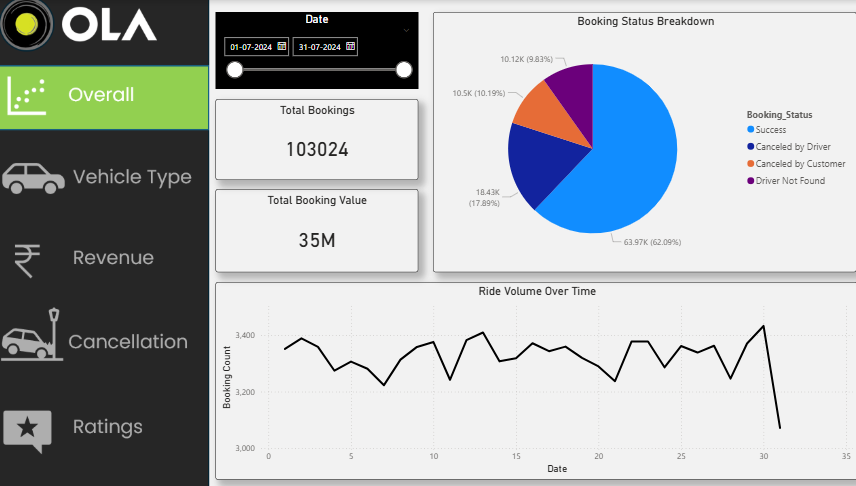
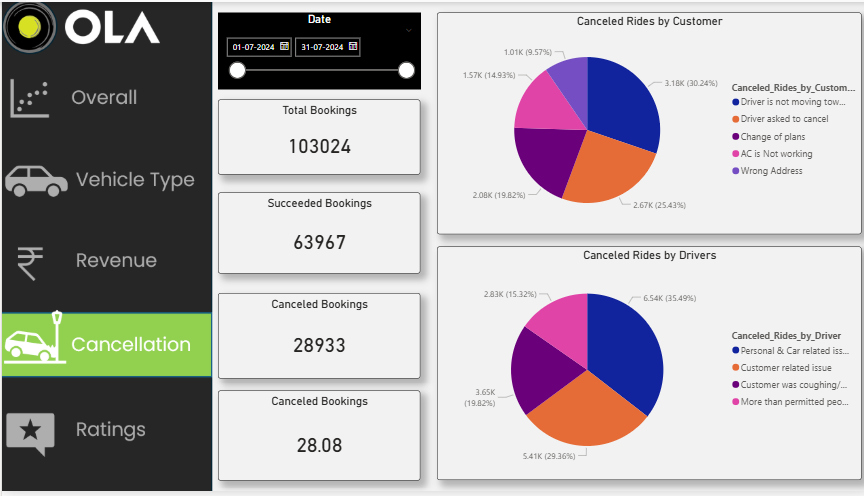
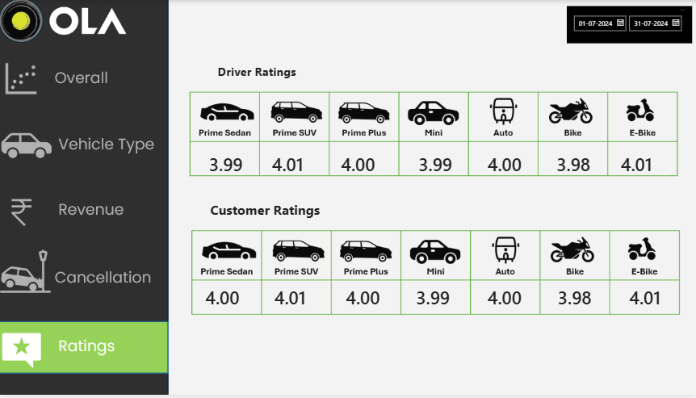

# 🚖 Ola Data Analysis Project 


## 📌 Project Overview
This project provides a 360-degree analysis of Ola's ride-booking operations. By processing raw booking data through **SQL** and visualizing it in **Power BI**, I uncovered key drivers of cancellations, revenue leakages, and customer satisfaction levels.

## 📊 Dashboard Visuals
> **Note:** Below are the snapshots of the interactive dashboard developed in Power BI.

### 1. Overall Performance & Revenue
*Snapshot of the core KPIs including total bookings, success rates, and total booking value.*


### 2. Cancellation Analysis
*Deep-dive into why rides fail, categorized by Customer vs. Driver reasons.*


### 3. Service Quality (Ratings)
*Tracking driver and customer feedback across different vehicle segments.*


---

## 💡 Key Business Insights
After analyzing the data, I identified several actionable trends:

* **Cancellation Bottlenecks:** A significant percentage of cancellations occurred due to "Driver not moving towards pickup." This suggests a need for better driver-side GPS tracking or stricter acceptance-to-arrival time protocols.
* **Revenue Leaders:** The **Prime Sedan** and **Mini** categories contribute to over 60% of total revenue, making them the most critical segments for fleet maintenance.
* **Customer Loyalty:** 5% of customers contribute to nearly 15% of total bookings, indicating a strong opportunity for a "Premium Loyalty" tier.
* **Payment Trends:** Cash remains a dominant payment method for short-distance trips, while digital payments spike for "Prime SUV" bookings.

---

## 🛠️ Technical Implementation

### SQL: Data Extraction & Transformation
I used SQL to clean the dataset and answer specific business questions.
```sql
-- Calculating the Success Rate of bookings
SELECT 
    (COUNT(CASE WHEN Booking_Status = 'Success' THEN 1 END) * 100.0 / COUNT(*)) AS Success_Rate
FROM july_bookings;
