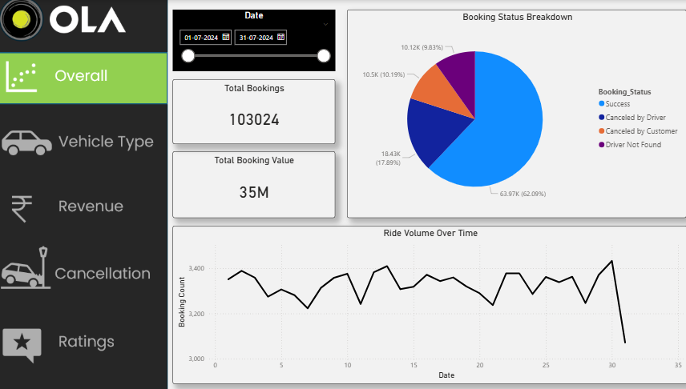
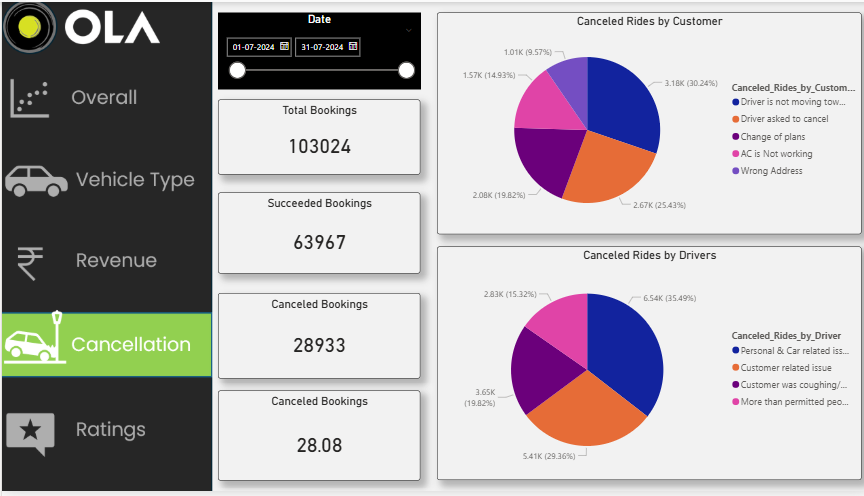
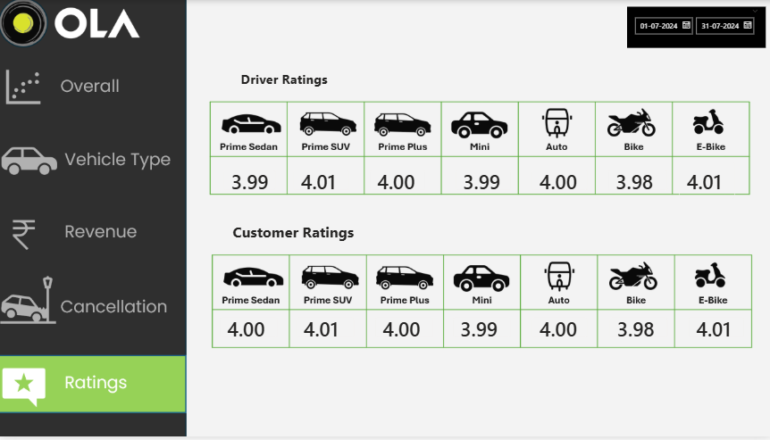

# 🚖 Ola Data Analysis Project 

# Ola Ride-Booking Operations Data Analysis

An end-to-end data analytics project providing a 360-degree operational diagnosis of ride-booking performance. This pipeline ingests transactional trip logs, handles large-scale data auditing, executes business logic transformations using SQL, and deploys multi-layered executive dashboards to optimize booking success rates and mitigate revenue leakage.

---

## 📌 Project Overview
The objective of this project is to analyze raw ride-booking data to uncover structural drivers behind booking cancellations, track revenue performance across fleet segments, and isolate factors influencing customer satisfaction. By bridging raw transaction logs with interactive visual intelligence, this analysis provides data-backed recommendations to improve fleet utilization and passenger retention.

---

## 📊 Key Insights & Business Outcomes

Based on structured database queries and visual analysis of over 100,000 transaction rows, the following core operational realities were identified:

* **Operational Baseline:** Evaluated key metrics across a high-volume transactional baseline, establishing localized ride success rates, overall booking volume distribution, and structural revenue performance.
* **Cancellation Bottlenecks:** A critical volume of dropped rides is driven by *"Driver not moving towards pickup"* and *"Customer not reachable"*. Addressing these specific friction points via localized dispatch optimization or tighter acceptance-to-arrival protocols represents a major opportunity to reclaim lost bookings.
* **Segment Revenue Drivers:** The **Prime Sedan** and **Mini** vehicle categories jointly drive over **60% of total gross revenue**. These two tiers represent the operational core of the business, making them the highest priority for targeted driver-retention incentives and fleet maintenance.
* **Customer Distribution Dynamics:** A concentrated **5% segment of power-users** accounts for approximately **15% of total completed bookings**, indicating an immediate opportunity to introduce a structured "Premium Loyalty Tier" to secure high-frequency recurring revenue.
* **Payment Mode Preferences:** Cash remains highly dominant for low-tier, short-distance trips, whereas digital and wallet transactions spike significantly within premium segments like **Prime SUV** bookings.

---

## 📈 Executive Dashboard Previews

### 1. Overall Performance & Revenue
An operational macro-view tracking core transaction health, overall booking counts, and gross booking value distributions.


### 2. Cancellation Deep-Dive
A granular look into automated and manual ride failures, isolating customer-side cancellations from driver-side rejections.


### 3. Service Quality & Feedback Matrix
Evaluating customer and driver rating distributions mapped against distinct vehicle categories to isolate service degradation.


### 4. Fleet & Vehicle Utilization
Asset utilization metrics tracking demand patterns and operational volume across different car segments.


---

## 🛠️ Technical Implementation & Tool Stack

* **Excel:** Managed massive tabular staging via `Bookings-100000-Rows (1).xlsx`. Used for initial data verification, handling raw layout limits, and schema structure auditing before server ingestion.
* **SQL (Structured Query Language):** Built foundational data manipulation scripts within `ola.sql` to clean the transaction dataset, handle empty values, and execute targeted diagnostic queries.
* **Power BI:** Engineered interactive reporting layers inside `ola.pbix` utilizing relational data models, customized DAX metrics, and conditional filtering to break down operational bottlenecks.

---

## 📂 Repository Architecture

The repository files correspond directly with distinct phases of the analytical lifecycle:

* **Data & Ingestion Layers:**
  * `Bookings-100000-Rows (1).xlsx` - The raw, validated ride-booking transaction ledger containing 100,000 operational records.
* **Database Transformation:**
  * `ola.sql` - Production SQL script covering transactional filters, volume aggregations, and cancellation calculation logic.
* **Business Intelligence & Reporting Assets:**
  * `ola.pbix` - Complete interactive Power BI dashboard application with embedded data relationships and reporting pages.
  * `Ola-report.pdf` - Compiled static executive summary document for stakeholder distributions.
* **Dashboard Assets:**
  * `overall.png`, `cancellation.png`, `Ratings.png`, and `Vehicle .png` - Embedded visualization blocks rendering directly into documentation.

---

## 🚀 How to Reproduce this Analysis

1. **Database Script Execution:** Open `ola.sql` in your SQL client and execute the queries against your imported transaction table to verify the underlying KPIs and transformation logic.
   ```sql
   -- Example: Evaluating the structural success rate of bookings
   SELECT 
       (COUNT(CASE WHEN Booking_Status = 'Success' THEN 1 END) * 100.0 / COUNT(*)) AS Success_Rate
   FROM july_bookings;
